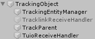
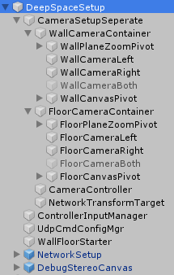
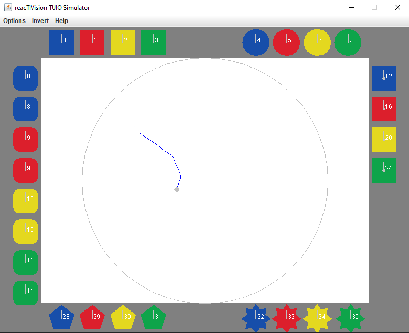

# Horizono - A Simulation for the AEC DeepSpace

## About
Horizono is a Unity-based simulation that aims to erase the commonly known stigma of programmers. It was created by three students of the HTL Leonding with the help of several employees of the AEC FutureLab. 

### The DeepSpace
The DeepSpace is a big VR-Room that is made of two screens each 16x9m. Each screen has a resolution of almost 8k (wall: 6467x3830, floor: 6467x3595). There is one projection for the Wall and one for the Floor. Both can be used as one big screen to get a VR-experience. Each screen is used by a different computer, so in order to run both screens synchronously you have to use networking to communicate between the screens.
The DeepSpace is also equipped with a Laser-Tracking-System called **"Pharus"**. Pharus is used for the interaction of the viewer with the game.

### Used Technologies
* Unity 2018.3.5
* Blender
* Gimp / Photoshop
* C#
* FutureLab DevKit

## First Steps

**Notes:**
* Make sure you have the right unity version (V 2018.3.5). You can download the right Unity version on this page: https://unity3d.com/de/get-unity/download/archive

First of all it is good to get familiar with the Unity environment. Look up for some basic tutorials to get used to the objects and animations in Unity.

After getting familiar with the environment, a knowledge about the Development Kit and the documentation of FutureLab is necessary. The structure of this project is based on the FutureLab DevKit which is reachable on this Link: https://github.com/ArsElectronicaFuturelab/DeepSpaceDevKit.

Basically to develop simulations for the DeepSpace, environments like Unity are not required. You are able to use other game engines as well. But the FutureLab recommends using Unity as they have had a very good overall experience with Unity.

***Hint***
It is recommended that team members divide themselves into several aspects. This is not only more time-saving, but also more efficient. Our group: Bochis, Dönmez, Mohammed were divided into... Tracking, Modeling & Animation... Of course, you help your colleagues and get knowledge from other areas. In principle, programming is necessary for all members.

## Projekt download - Github
Clone our Github repository: https://github.com/MohammedKevin/Horizono.git

## Project Structure
If you open the Scene "AECProject" under /Assets/Scenes you may find the project. It is structured in this way:<br>


### Explanation:
* **Directional Light:** Can be ignored as it has no use.
* **DeepSpaceSetup:** Includes the DevKit, which will be explained later on.
* **EventSystem:** Was created by Unity, but is not used. It can be ignored
* **TrackingObject:** Contains all Entities that are used for Pharus Tracking. (Scripts are from DevKit)<br>
    
    * TrackLinkReceiveHandler: Handles incoming tracking data over TrackLink-Procotoll
    * TuioReceiveHandler: Handles incoming tracking data over TUIO-Procotoll
    * TrackingEntityManager: Manages the incoming data over the ReceiveHandlers, creates TrackingEntity and saves it under TrackParent.
    * TrackParent: Stores all current TrackingEntities, that are on the floor. If a TrackingEntity leaves the floor, the TrackEntity in Unity will be deleted.
    <br>Diffence TUIO and TrackLink:
        - TrackLink uses Unique IDs for every TrackEntity created. TUIO allocates the first available ID from 0 and above
        - In the DeepSpace there was the problem with TrackLink, that TrackLink-Protocoll did not use the right network cards to fetch the data from and send the data to the wall and floor simulations, so we had to manually deactivate unused network card and activate the right ones. With TUIO it should be done automatically. But as for now (11.01.21) we have not had the chance to test TUIO so we can prove this assumtion. (This part will be edited after the test was made on 19.01.21)
* **SceneXState:** For each game scene we did not create a Unity scene, but a scene prefab that is activated through a **State Machine**.
* **Env:** Environment as hills, floor grid, etc. (only change if you want to change the aesthetics). Under Env you can also find the **State Machine**.<br>


## Dev Kit
The DeepSpace Setup from the DevKit is structured as on this picture:


### Explanation
* **CameraSetupSeperate:** Contains **WallCameraContainer** and **FloorCameraContainer**. Each container contains two cameras for each panel. Two cameras are used to create a so-called "Stereo-Effect". The camera positions and directions must not be changed unless you want to change camera positionings and resolution for a Holo-Lens-Project.
    It also contains **CameraController** and **NetworkTransformTarget**, which are automatically used by the DevKit. Those two object shall not be changed to provide a fluent execution.
* **ControllerInputManager:** Is used by the DevKit and shall not be changed.
* **UdpCmdConfigMgr:** Is used by the DevKit and shall not be changed. The only parameter that can be changed is **Application Type**. You can choose between **FLOOR** and **Wall** to change the camera setup. Floor mode deactivates wall cameras and activates the floor cameras and Wall mode does the exact opposite.
* **WallFloorStarter:** Is used by the DevKit and shall not be changed.
* **NetworkSetup:** Is used by the DevKit for Networking/communication between floor and wall.
* **DebugStereoCanvas:** Is used by the DevKit and shall not be changed.

For further informations about the DevKit you can go through the DevKit-documentation: 
https://immersify.eu/wp-content/uploads/2020/05/Guidelines-Deep-Space-Dev-Kit.pdf

## State Machine

The Project is controlled by a state machine [State Machine](https://de.wikipedia.org/wiki/Zustand_(Entwurfsmuster)). Every scene is a state. The state machine loads all scenes and then run them all in a defined order.

State Machine Pattern example:


The StateController gameobject in Env ist the parent object of a state machine. The StateController uses the StateController.cs class. The StateController class contains an instance of the StateMachine.cs class which is a implementation of the state machine pattern. The StateController class uses the StateMachine and orchestrates all the states.

Over the StateController, which every scene prefab has access to, you can change the state of the state machine. In other words you can change the scene. This is done with the method ```NextState()```. In order to get all scenes the method ```getStates()``` will be called at the initialization of the StateController.

## Scenes
A Scene in Unity is one large binary file. To Avoid merge Conflicts when multiple People are working on diffrent things in the same scene. We converted every scene to a prefab. Prefabs have dedicated files. This prevents major merge conflicts

### Scripts
Every scene has its own scripts. For every scene we have created a folder with the scripts we used in this scene.
> Note: Scene 1 scripts are stored under "ColissionScripts".

Every scene uses its own **SceneXScript** (for example for scene 2: SceneTwoScript) and a generic **EndSceneScript**. All SceneXScripts are saved under /Assets/Scripts/StateMachine/States and the EndSceneScript is saved under /Assets/Scripts/StateMachine.

```EndSceneEvent()``` of the EndSceneScript.cs will be called at the end of every scene.

### Scene 1
To activate phone and to move to the wall you have to step on the homebutton. 
In HomebuttonScript.cs you can see how the trigger has been set. The moment the TrackingEntity collides with the homebutton the method ```OnTriggerEnter(Collider other)``` will be called and in that method the trigger will be set so that the phone can move to the wall through animations. 

> Animations can be created in the Animator window (Window -> Animation -> Animator)

After the phone moved to the wall 4 message bubbles appear on the wall and 4 buttons appear on the floor. By standing on a button you can choose the message that is linked to the button. In order to lock in that message you have to stand on the for 5 seconds. You can wait for 5 seconds with a ```yield return new WaitForSeconds(5)```. With that call you can delay every other action for 5 seconds and you also delay the end of the method (more information about yield return: https://docs.microsoft.com/en-us/dotnet/csharp/language-reference/keywords/yield)

If a user stands on a button for 5 seconds the chosen message will be locked in on the phone and all fade-out-animations will start: The message bubbles and the buttons will fade out and the phone will move back to the floor.

In the end ```EndSceneEvent()``` in EndSceneScript.cs will be called to end scene 1.


### Scene 2
Scene 2 visualizes the encryption of the chosen message. First you can choose the RotX-encryption by stepping on a letter of the letter wheel on the ground. Following that the message will be encrypted letter by letter. Each letter will move to the letter of its own kind of the letter wheel (for example: letter 'k' moves to letter 'k' on the letter wheel) and will be encrypted. In the end all encrypted letters wil be merged together on the right side of the wall. The encrypted message will be put in a packet and the scene will be ended.

The selection of the letter is made with **Colisions** and the letter wheel and letter movements are done with animations.


### Scene 3
The 3rd scene is responsible for the play itself. It is characterised by the "Gamefloor", "Progressbar" and "Packages". 

**Gamefloor** - The field where the tracked players move from packet floor to slot floor. Several packages spawn on the packet floor, which then have to be transported to the corresponding slot.

**Progressbar** - Depending on the score, the percentage of Progressbar filling is increased. Logically, the game ends after it is completely filled.

**Packages** - Since the data is represented in packages, the prefabs occur. 

The scene starts with a 5 second stand at the button. After the button has been pressed, there is a countdown. The players now prepare themselves for few seconds.

Now the trackers are ready to use. Any position is recorded and when an action is taken, it is processed.

The packages are now spawning. Now it is the players' goal to make sure that these objects are delivered from point A to point B. This means that the objects have to be transported to the corresponding slots by figure/color.
In parallel, the progress bar fills up. 

When the score reaches the maximum, the game ends automatically. It continues with **scene 4**.

### Scene 4

**Scene 4** is used to visualise the packages. We represent a global server, or the server that we have created through the tower. For mails, for example, this is to be understood as a mail server. Data packets enter the tower and leave it again. In the background are satelites that were also modelled by Blender.

To understand Blender, watch tutorials at https://www.blender.org/support/tutorials/ and make a basic knowledge about editing objects etc. 

There are no scripts behind these scene4-models. The combination of animation and object entices the player more into the world of Horizono.

### Scene 5

**Scene 5** is characterised by the highest score(s) of Horizono. The score is created by speed and accuracy or strategic action. With a maximum number of 10 teams, the HighScoreTable is realised.

The filling of this table is done with an overwriting of a CSV file. The current user is filled in a separate file ("current.csv") and either inserted or not inserted into the HighScore CSV file by control name="current.csv".

The files current/scores.csv consist of the values **name** and **score**.
 

### Scene 6 (to be done)
Scene 6 will be a scene that shows the decryption of the package and it should show the sent message on the end device. 


## Testing in Unity
To start the simulation just press the start button. In the "Game" Window you may only see either the wall or the floor projection. In order to see both you can also use the "Scene" Window.

The simulation often only continues if there is a collision has been triggered. For example in scene 1: to move the phone to the wall you have to stand on the homebutton. The phone-to-wall animation is triggered as the TrackingEntity collides with the homebutton.
### Tracking Simulation in Unity
As for now as we have not tested the TUIO-protocol yet, we still use the TrackLink-protocol. With the TrackLink-protocol you can simulate the Pharus Tracking-System with the **TrackLinkSimulator**.

#### TrackLinkSimulator


With right-click on the simulator you can create a TrackingEntity with a unique ID. You can move the TrackingEntity per drag-and-drop and with right-click on a TrackingEntity you can delete it.

**IMPORTANT!!** You must not resize the window, because by resizing the window you the white dots are not scaled with the window size. It is also possible that you cannot grab a TrackingEntity anymore.

#### TUIO Simulator
The TUIO Simulator works a bit different than the TracklinkSimulator. You can create a TrackingEntity by clicking and holding the left mouse click on the white canvas.



Notes:
* **Important!!** By not moving the TrackingEntity for a couple seconds the TrackingEntity deletes itself!
* The colored shapes on the edge are not TrackingEntities. You can move them, but they have no influence on the Tracking-System.

Currently known (and unsolved) problems:
* If you create one TrackingEntity, delete it and create a new one, the simulator tries to reuse ids. Somehow the Simulation creates many more TrackingEntities with the same id, and the Trracking System won't work anymore until you restart it. We hope to clarify this problem in our next meeting in the Deep Space on 19.01.21.


You can download TUIO Simulator on this link: https://sourceforge.net/projects/reactivision/files/TUIO%201.0/TUIO-Clients%201.4/TUIO_Simulator-1.4.zip/download?use_mirror=deac-ams&download=
